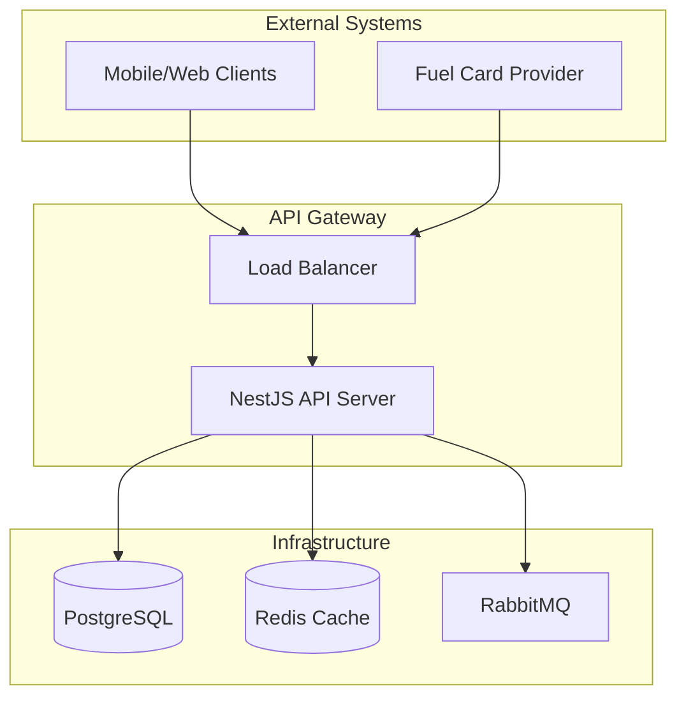
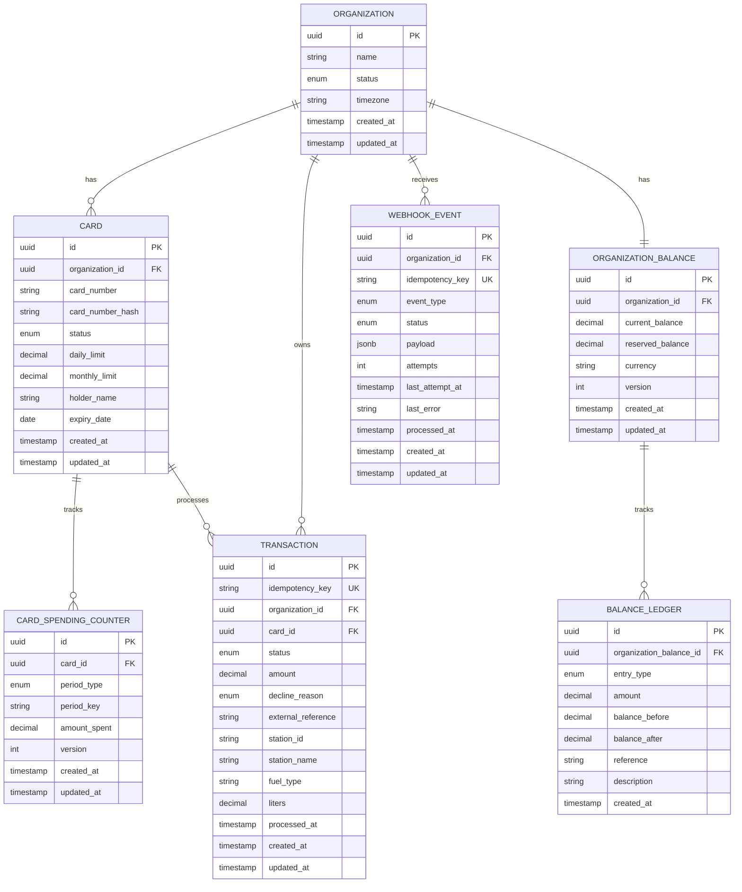
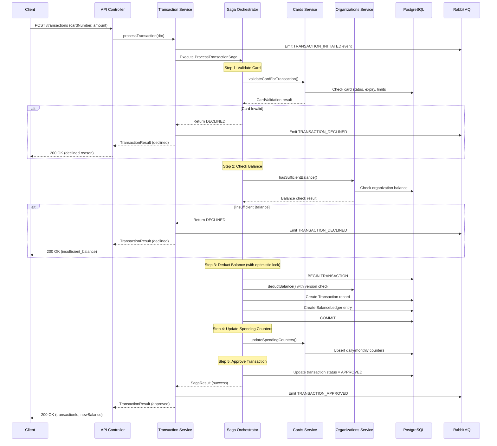
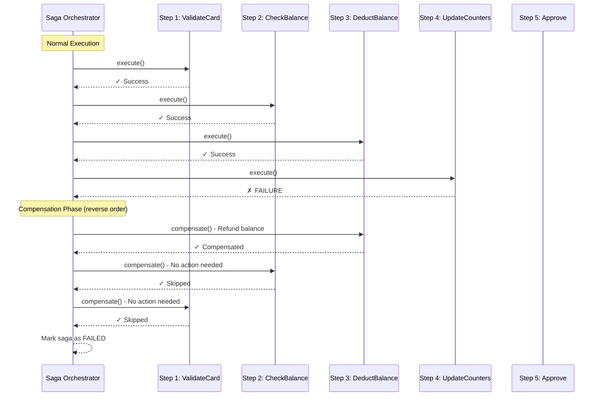
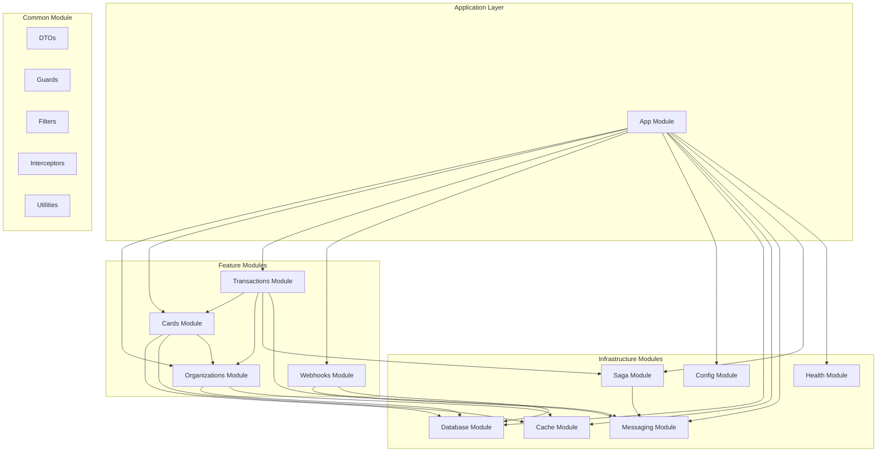
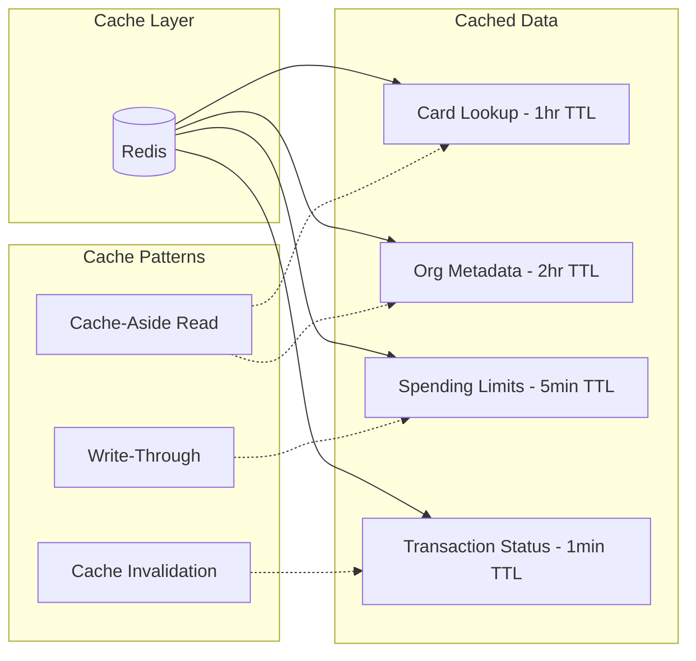
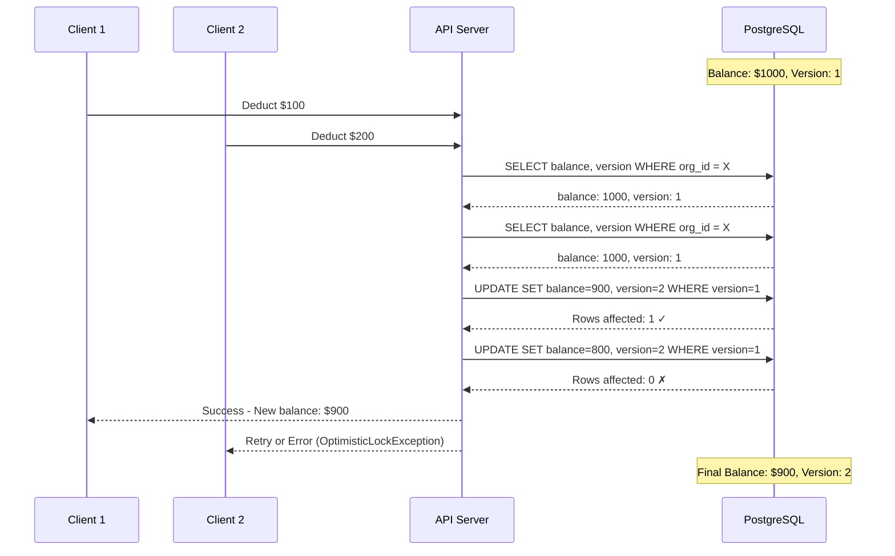
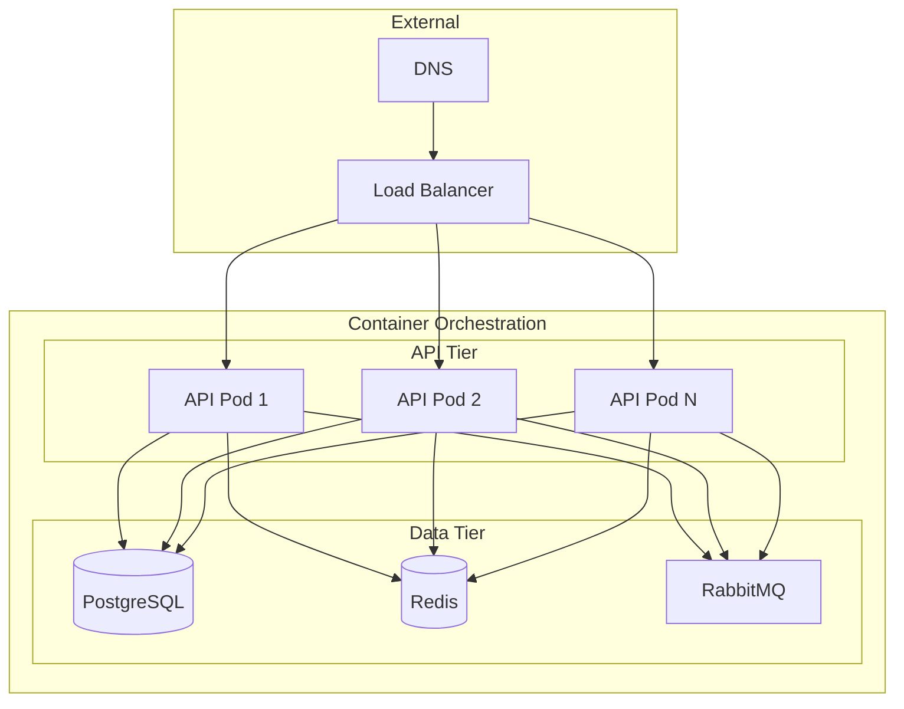
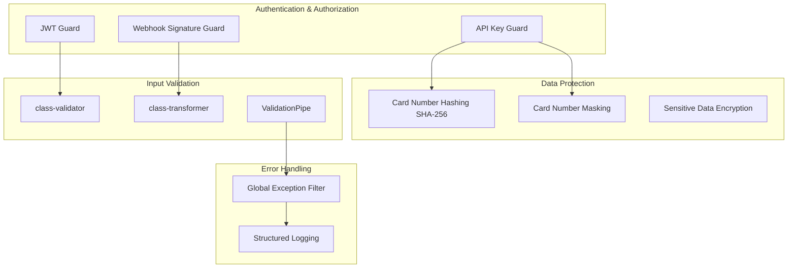

# MyFuel API - Architecture Documentation

## System Overview

## Entity Relationship Diagram

## Transaction Flow - Saga Pattern

## Saga Compensation Flow

## Module Architecture

## Caching Strategy

## Optimistic Locking Flow

## Deployment Architecture

## Security Model

